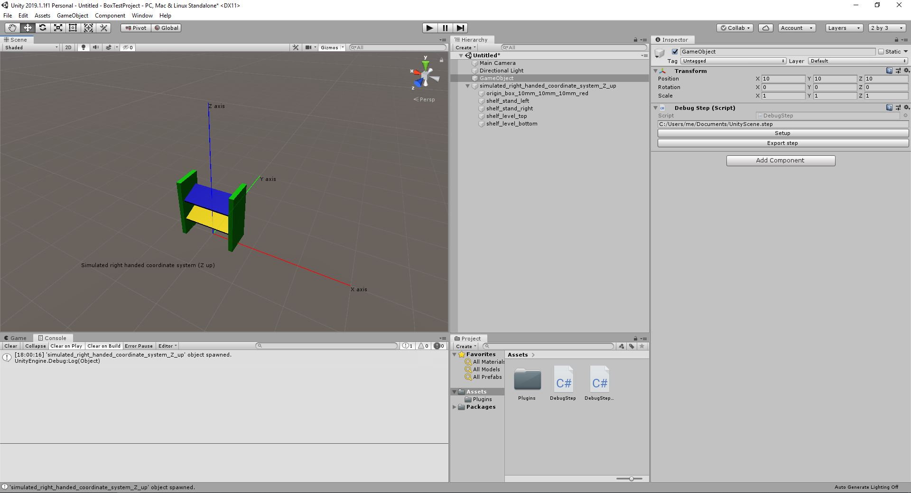

# Simple STEP Exporter
Simple C# (.NET 4) library for writing basic geometry data into STEP AP 214 (ISO-10303) file format.

 

## Supported
At the moment this library only supports wrting boxes to the STEP file format. The following properties can be specified for a box:
* part name
* position
* rotation
* size
* color  

Each box is a separate part. All parts are organized under a root assembly thats name can be specified.

## Limitations
* writing deep hierarchy information is not supported
* the whole project is work in progress

# Quick start
1. Specify your _FILEPATH_ in _Program.cs_
2. Run SimpleStepWriterCLI project
3. Press __enter__ to write sample content to STEP file

  

# Getting started
1. Build the library (.NET 4)
2. Add library as a dependency to your porject
3. Create StepFile instance, add boxes and write the Step file:

  

# Unity debug environment
This repository contains two scripts _DebugStep.cs_ and _DebugStepEditor.cs_ that help with debugging the export pipeline. You can find them in the _resources/Unity/_ directory.  
These scripts simulate a right handed (Z up) coordiante system in Unity and create the example shelf model in the scene (the same example model that is build in the _SimpleStepWriterCLI_ project). You can add and remove cubes or edit the Transform values of the cubes so that you can easily build a scene for exporting as STEP AP 214 file. That STEP file can then be imported in a CAD software. The Unity scene and CAD scene should look identical.  

1. Add _DebugStep.cs_ and _DebugStepEditor.cs_ to you Unity project _(Tested with Unity 2019.1.1f1)_  
2. Build the _SimpleStepWriter_ project so that you receive the _SimpleStepWriter.dll_
3. Copy _SimpleStepWriter.dll_ in a folder named _Plugins_ that sits in your Unity project folder
4. Attach _DebugStep.cs_ to a new GameObject in your scene
5. Change the export path in the _DebugStep.cs_ custom inspector and use the _Setup_ button to setup the right handed coordinate system environment within the scene  
6. Click _Export step_ to export all cubes under the root GameObject _(simulated_right_handed_coordinate_system_Z_up)_  

Every 3D cube under the root object _(simulated_right_handed_coordinate_system_Z_up)_ will be exported. You are able to add multiple cubes under the root object and change the values of the Transform component, the main color of the material and the name of the GameObject.

  
# Example data visualized in FreeCAD

# Resources
* https://github.com/FreeCAD/FreeCAD
* https://www.freecadweb.org/
