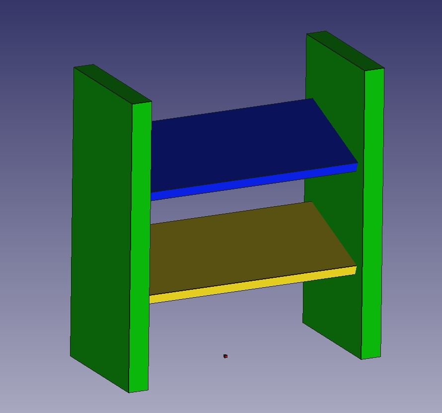
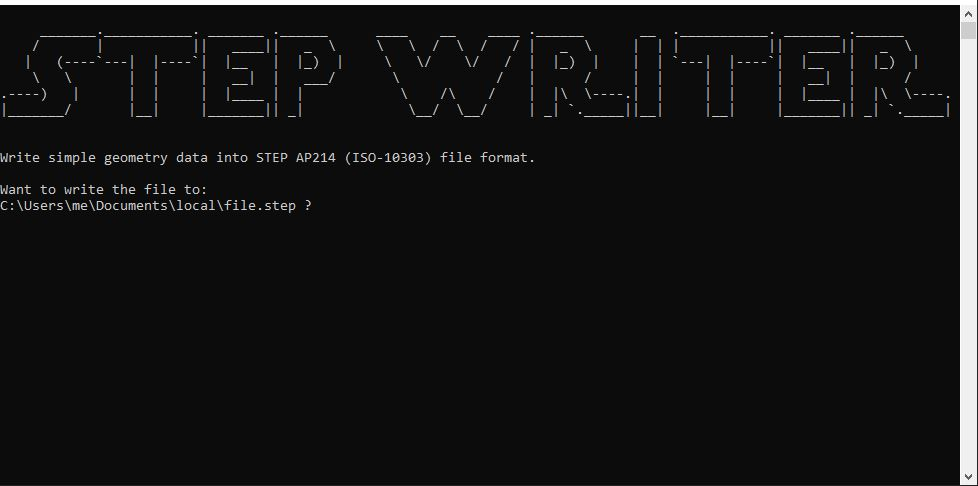
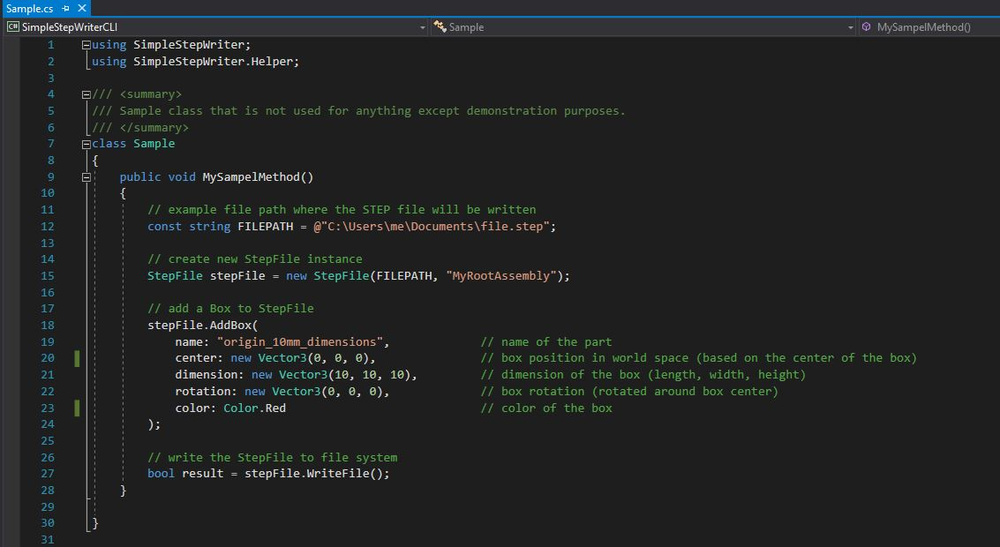
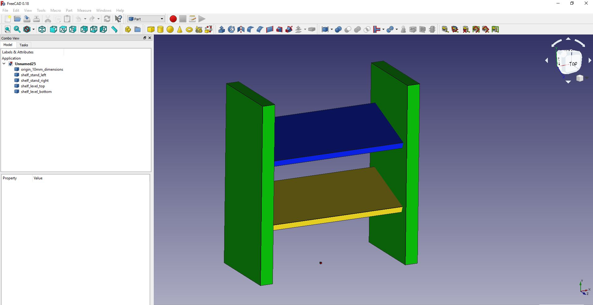

# Simple STEP Exporter
Simple C# (.NET 4) library for writing basic geometry data into STEP AP 214 (ISO-10303) file format.

 

## Supported
At the moment this library only supports wrting boxes to the STEP file format. The following properties can be specified for a box:
* part name
* position
* rotation
* size
* color

## Limitations
* writing hierarchy information is not supported
* Box class is still work in progress (highly inefficient and monolithic but working)

# Quick start
1. Specify your _FILEPATH_ in _Program.cs_
2. Run SimpleStepWriterCLI project
3. Press __enter__ to write sample content to STEP file

  

# Getting started
1. Build the library (.NET 4)
2. Add library as a dependency to your porject
3. Create StepFile instance, add boxes and write the Step file:

  

# Example data visualized in FreeCAD

# Resources
* https://github.com/FreeCAD/FreeCAD
* https://www.freecadweb.org/
