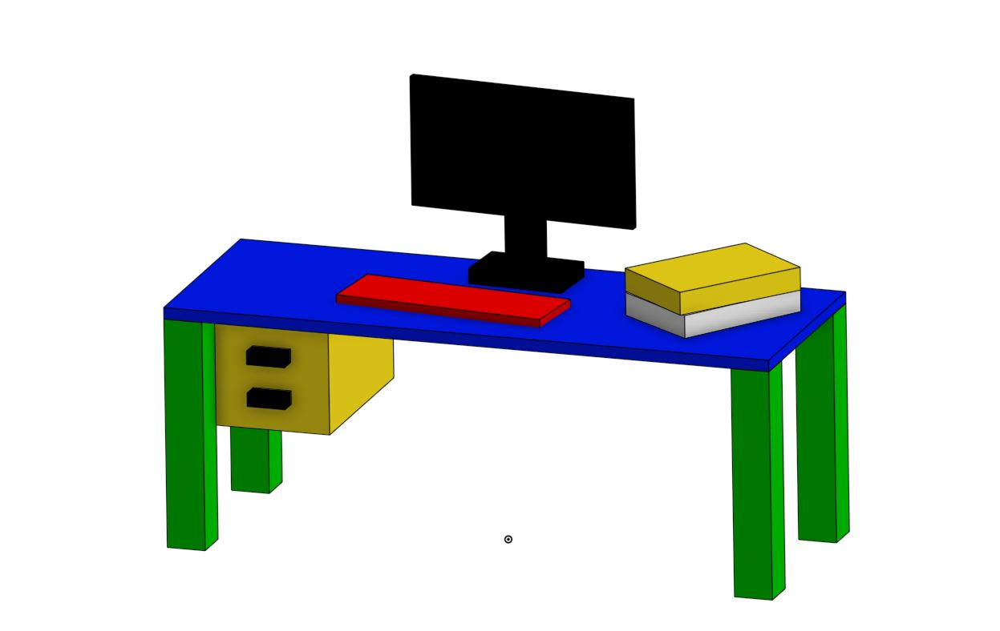
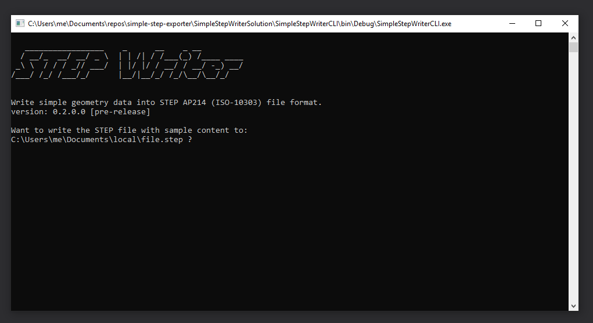
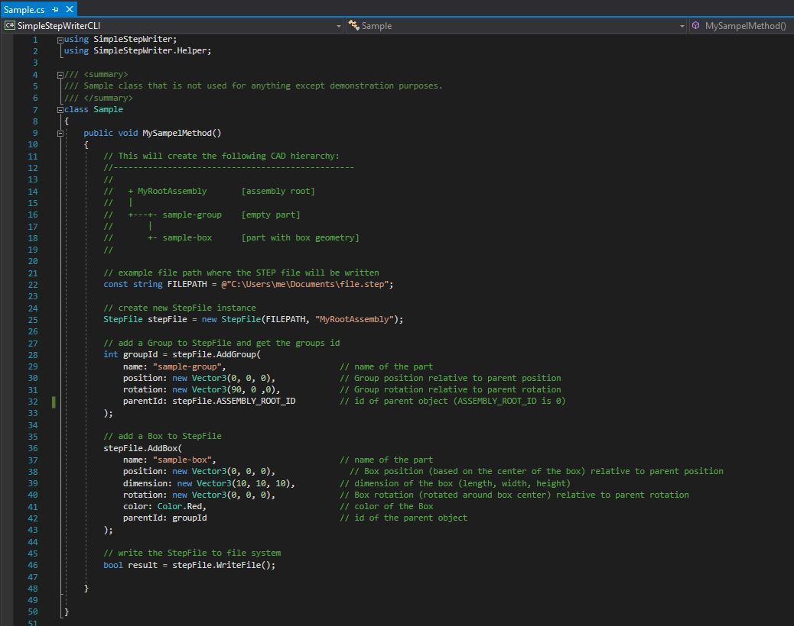
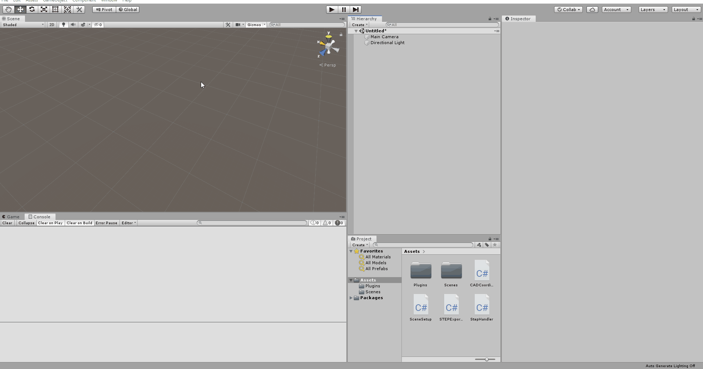
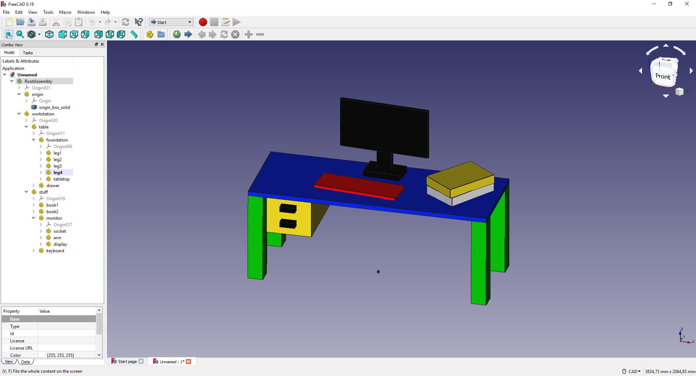

# Simple STEP Exporter
Simple C# library for writing basic geometry data into STEP AP 214 (ISO-10303) file format.

[](https://travis-ci.com/fabianschl/simple-step-exporter)

   
_(screenshot taken in OnShape)_

## Quick start
1. Specify your `FILEPATH` in `Program.cs`
2. Run SimpleStepWriterCLI project
3. Press `enter` to write sample content to STEP file

  

## Getting started
1. Build the library (.NET 4)
2. Add library as a dependency to your project
3. Create StepFile instance, add boxes and write the Step file:


#### Add namespaces
```
using SimpleStepWriter;  
using SimpleStepWriter.Helper;  
```

#### Create a new StepFile instance
```
StepFile stepFile = new StepFile(@"C:\Users\me\Documents\file.step", "MyRootAssembly");  
```

#### Add a group to the StepFile (optional) and retrieve the ID
```
int groupId = stepFile.AddGroup(
            name: "sample-group",                       // name of the part
            position: new Vector3(0, 0, 0),             // Group position relative to parent position
            rotation: new Vector3(90, 0 ,0),            // Group rotation relative to parent rotation
            parentId: StepFile.ASSEMBLY_ROOT_ID         // id of parent object (ASSEMBLY_ROOT_ID is 0)
        );
```

#### Add one or more boxes to the StepFile
```
stepFile.AddBox(
            name: "sample-box",                         // name of the part
            position: new Vector3(0, 0, 0),             // Box position (based on the center of the box) relative to parent position 
            dimension: new Vector3(10, 10, 10),         // dimension of the box (length, width, height)
            rotation: new Vector3(0, 0, 0),             // Box rotation (rotated around box center) relative to parent rotation
            color: Color.Red,                           // color of the Box
            parentId: groupId                           // id of the parent object
        ); 
```

#### Write the STEP file to the file system or get byte data
```
bool result = stepFile.WriteFile();  
```
_or_ 
```
byte[] data = stepFile.GetByteData();
```

#### Sample.cs



## Knowledge

#### Supported
At the moment this library only supports wrting parts with box geometry and empty parts, serving as groups, to the STEP file format. The following properties can be specified:

##### Box:
* name
* position
* rotation
* size
* color 
* parent

##### Group:
* name
* position
* rotation
* parent

Each __Box__ and __Group__ is a separate part. All parts can be organized in a hierarchical structure under a root assembly thats name can be specified too.   
__Boxes__ can't have children themselves. __Groups__ on the other hand can have Boxes and other Groups as children.  
Each part (Box and Group) always has a parent (either the root assembly directly or a group that was already added).  

#### Limitations
* only box geometry is supported, no complex geometry for now  
* string formatting for _double_ type is not optimized for storage   
* materials are not shared, every box has its own material
* the whole project is work in progress  

#### Technical
This library targets .NET 4 and is written in C# 7.2.
It is compatible with Unity 2019.1.1f1 (other versions not tested).

## Unity debug environment

This repository contains four C# scripts for Unity that help with debugging the export pipeline. You can find them in the `./resources/Unity/` directory.  
These scripts simulate a right handed (Z up) coordiante system in Unity and create the example workstation model in the scene (the same example model that is build in the _SimpleStepWriterCLI_ project).  
You can add __Cubes__ and __empty GameObjects__ to the root GameObject where the first simulates a __Box__ and the latter a __Group__.
In addition you can edit the _transform_, _name_ and _material main color_ values. All these properties affect the generated STEP AP 214 file.

That STEP file can then be imported in a CAD software. The Unity scene and CAD scene should look identical.  

1. Add the four scripts to you Unity project
2. Build the _SimpleStepWriter_ project
3. Copy `SimpleStepWriter.dll` in a folder named `Plugins` that sits in your Unity project folder
4. In Unity click `Window -> STEP Export` to open the editor extension
5. Use the `Setup` button to setup the Unity scene (right handed coordinate system  + sample model)
6. Change the `export path`
7. Cick `Export STEP` to export the hierarchy (Cubes + empty GameObjects) under the root GameObject named _'simulated_right_handed_coordinate_system_Z_up'_ 

Every 3D Cube and empty GameObject under the root GameObject will be exported. You are able to create a custom hierarchy under the root GameObject, but it's not allowed for 3D Cubes to have child GameObjects. Instead empty GameObjects can have 3D Cubes and empty GameObjects as children.

 _(Tested with Unity 2019.1.1f1)_    
  

## CAD software tested
The following applications have already been successfully tested:
* FreeCAD 0.18  
* OnShape _(testen on 2019-06-03)_
* OPEN CASCADE CAD Assistant 1.2.1  
* Autodesk AutoCAD 2020 _(hierarchy not tested)_
* Autodesk Inventor 2020  _(hierarchy not tested)_

## Example data visualized in FreeCAD


## Resources
* https://github.com/FreeCAD/FreeCAD
* https://www.freecadweb.org/
* https://www.onshape.com/
