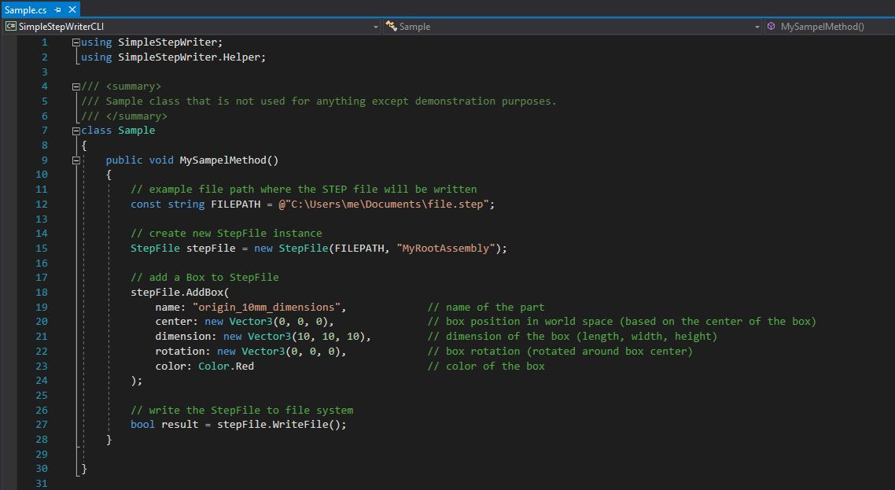

# Simple STEP Exporter
Simple C# (.NET 4) library for writing basic geometry data into STEP AP 214 (ISO-10303) file format.

[](https://travis-ci.com/fabianschl/simple-step-exporter)

 

## Quick start
1. Specify your `FILEPATH` in `Program.cs`
2. Run SimpleStepWriterCLI project
3. Press `enter` to write sample content to STEP file

  

## Getting started
1. Build the library (.NET 4)
2. Add library as a dependency to your project
3. Create StepFile instance, add boxes and write the Step file:


#### Add namespaces
```
using SimpleStepWriter;  
using SimpleStepWriter.Helper;  
```

#### Create a new StepFile instance
```
StepFile stepFile = new StepFile(@"C:\Users\me\Documents\file.step", "MyRootAssembly");  
```

#### Add one or more boxes to the step file
```
stepFile.AddBox(  
            name: "origin_10mm_dimensions",             // name of the part  
            center: new Vector3(0, 0, 0),               // box position in world space (based on the center of the box)  
            dimension: new Vector3(10, 10, 10),         // dimension of the box (length, width, height)  
            rotation: new Vector3(0, 0, 0),             // box rotation (rotated around box center)  
            color: Color.Red                            // color of the box  
        );  
```

#### Write the STEP file to the file system
```
bool result = stepFile.WriteFile();  
```

#### Sample.cs


## Unity debug environment

This repository contains two scripts __DebugStep.cs__ and __DebugStepEditor.cs__ that help with debugging the export pipeline. You can find them in the `./resources/Unity/` directory.  
These scripts simulate a right handed (Z up) coordiante system in Unity and create the example shelf model in the scene (the same example model that is build in the _SimpleStepWriterCLI_ project).  
You can add and remove cubes or edit the Transform values of the cubes so that you can easily build a Unity scene for exporting as STEP AP 214 file. That STEP file can then be imported in a CAD software. The Unity scene and CAD scene should look identical.  

1. Add `DebugStep.cs` and `DebugStepEditor.cs` to you Unity project
2. Build the _SimpleStepWriter_ project
3. Copy `SimpleStepWriter.dll` in a folder named `Plugins` that sits in your Unity project folder
4. Attach `DebugStep Component` to a new GameObject in your Unity scene
5. Change the `export path` in the _DebugStep.cs_ custom inspector
6. Use the `Setup button` in the custom inspector to setup the right handed coordinate system environment
7. Cick the `Export step button` to export all cubes under the root GameObject named _'simulated_right_handed_coordinate_system_Z_up'_ 

Every 3D cube under the root object will be exported. You are able to add multiple cubes under the root object and change the values of the Transform component, the main color of the material and the name of the GameObject.  

 _(Tested with Unity 2019.1.1f1)_    
  

## Knowledge

#### Supported
At the moment this library only supports wrting boxes to the STEP file format. The following properties can be specified for a box:
* part name
* position
* rotation
* size
* color  

Each box is a separate part. All parts are organized under a root assembly thats name can be specified.

#### Limitations
* only box geometry is supported, no complex geometry for now  
* writing deep hierarchy information is not supported  
* string formatting for _double_ type is not optimized for storage   
* materials are not shared, every box has its own material  
* the whole project is work in progress  

## CAD software tested
The following applications have already been successfully tested:
* FreeCAD 0.18  
* Autodesk AutoCAD 2020  
* Autodesk Inventor 2020  
* OPEN CASCADE CAD Assistant 1.2.1  

## Example data visualized in FreeCAD


## Resources
* https://github.com/FreeCAD/FreeCAD
* https://www.freecadweb.org/
